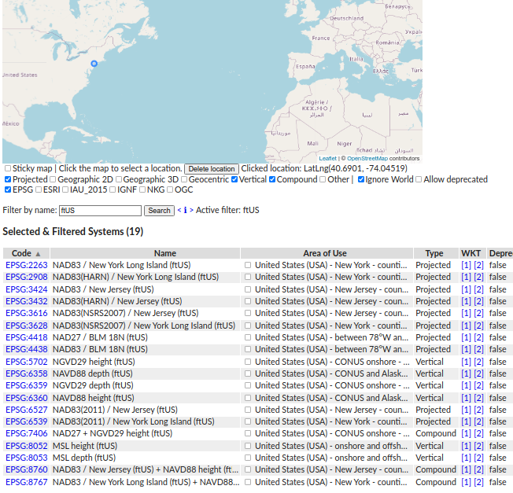

# CRS Explorer
Browse on PROJ _coordinate reference systems_, fast and easy.

## Visit 
https://jjimenezshaw.github.io/crs-explorer/

Click on the map if you want to select only the systems that include that location. Select as well the type of CRS, and the authority of your interest. For EPSG systems you can click the code-link to visit their specs.

Selecting the checkboxes next to the "areas of use" will display a rectangle in the map.

Use the `Filter by name` form to search on the Name column (click the info `<i>` to understand the syntax).

There are available the WKT 1 and 2 (generated by PROJ as WKT1_GDAL and WKT2_2019) as links to static files. If your browser is helpful, you can see them also as a tooltip.

It looks something like this:

You can directly show [all available reference systems](https://jjimenezshaw.github.io/crs-explorer/?all=true) in this link, more than 12500 so far.

## Why
Many people asked "Which coordinate (reference) system should I use in my project/country/state/location?", "Really, is there a vertical one in my country?" or  "What is the _right_ WKT for _this_ CRS?".

Well, instead of doing a research every time, just look what is available in [PROJ](https://proj.org). The command line application `projinfo` can be tedious, and not easy for many people. For some use cases, this is an "easy to use" version available on the browser.

PROJ includes an updated version of [EPSG](https://epsg.org) database, ESRI and some other authorities (looking for a deprecated ESRI CRS? visit [ESRI codes analyzer](https://github.com/jjimenezshaw/Esri-codes-analyzer)).

The behavior was inspired in https://cdn.proj.org (that shows the grid files from PROJ-data in a map) in combination with the option `--list-crs` of the program [projinfo](https://proj.org/apps/projinfo.html)

## Data generation
The static html page loads a json file generated from [PROJ](https://proj.org) with [pyproj](https://pyproj4.github.io/pyproj/stable/). 
To produce the `crslist.json` file you have to build pyproj with the desired version of PROJ. In my case, I did this:
 * export PROJ_DIR=~/proj_install_folder/
 * export PROJ_LIB=~/proj_install_folder/share/proj/
 * pip uninstall pyproj
 * pip install git+https://github.com/pyproj4/pyproj.git
 * python3 ./scripts/proj2json.py

Or have a look at the folder [scripts](scripts). You can run easily in a docker image.

## Thanks
 * [PROJ](https://proj.org)
 * [Leaflet](https://leafletjs.com/)
 * [OpenStreetMap](https://www.openstreetmap.org/) 
